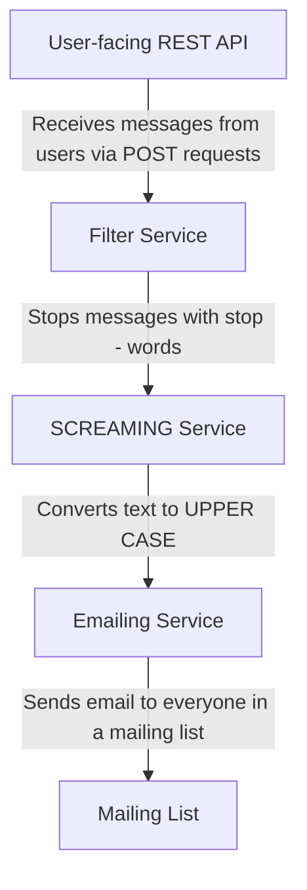

# Message Brokers System

This project implements an event-driven system using RabbitMQ as a message broker. The system is designed to process
text messages through a series of services, each performing a specific task. The services are:

1. **User-facing REST API**: Receives POST requests from users containing message text and user alias.
2. **Filter Service**: Filters messages for stop-words. If a message contains stop-words, it is not forwarded to the
   next service.
3. **SCREAMING Service**: Converts messages to uppercase.
4. **Emailing Service**: Sends emails to a specified mailing list with the processed message.

## Demo

### Event-Driven System

Success: 
https://github.com/dantetemplar/homework-message-brokers/blob/main/successful-message.mp4

Rejected:
https://github.com/dantetemplar/homework-message-brokers/blob/main/rejected-message.mp4

### Pipes-and-Filters

https://github.com/dantetemplar/homework-message-brokers/blob/main/pipes-n-filters.mp4

## System Architecture

The system follows a broker topology with RabbitMQ handling message passing between services. The services are designed
to be separately deployable units.



## Setup and Installation

1. Install [Python 3.12+](https://www.python.org/downloads/), [Poetry](https://python-poetry.org/docs/),
   [Docker](https://docs.docker.com/engine/install/)
2. Install project dependencies with [Poetry](https://python-poetry.org/docs/cli/#install).
   ```bash
   poetry install
   ```
3. Set up RabbitMQ:
   Ensure RabbitMQ is installed and running. You can use Docker compose to run RabbitMQ:
   ```bash
   docker compose up -d rabbitmq
   ```

4. Environment Variables:
   Set the following environment variables for SMTP configuration:
    - `SMTP_USER`: SMTP
      username ([how to get](https://yandex.ru/support/yandex-360/customers/mail/ru/mail-clients/others#imap-prep-config),
      e.g. `user.userovich@yandex.ru`)
    - `SMTP_PASSWORD`: SMTP password
    - `SMTP_SERVER`: SMTP server address (default `smtp.yandex.ru`)
    - `SMTP_PORT`: SMTP server port (default `587`)

## Event-Driven System with RabbitMQ

Benchmark using [loadtest](https://www.npmjs.com/package/loadtest) with the following command:

```bash
loadtest -t 20 -T application/json -P '{"text":"Hello, World!","alias": "Alice"}' http://127.0.0.1:8000/messages/
```

```
Target URL:          http://127.0.0.1:8000/messages/
Max time (s):        20
Concurrent clients:  60
Running on cores:    6
Agent:               none

Completed requests:  16605
Total errors:        0
Total time:          20.064 s
Mean latency:        71.6 ms
Effective rps:       828

Percentage of requests served within a certain time
  50%      70 ms
  90%      79 ms
  95%      85 ms
  99%      93 ms
 100%      106 ms (longest request)
```

### How to run

1. Start the API service:
   ```bash
   python api.py
   ```

2. Start the Filter service:
   ```bash
   python filter_service.py
   ```

3. Start the SCREAMING service:
   ```bash
   python screaming_service.py
   ```

4. Start the Emailing service:
   ```bash
   python emailing_service.py <email1> <email2> ...
   ```
5. Navigate to `http://localhost:8000/docs#/default/receive_message_messages__post` to send a message.

## Pipes-and-Filters

Benchmark using [loadtest](https://www.npmjs.com/package/loadtest) with the following command:

```bash
loadtest -t 20 -T application/json -P '{"text":"Hello, World!","alias": "Alice"}' http://127.0.0.1:8000/messages/
```

```
Target URL:          http://127.0.0.1:8000/messages/
Max time (s):        20
Concurrent clients:  60
Running on cores:    6
Agent:               none

Completed requests:  24894
Total errors:        0
Total time:          20.076 s
Mean latency:        47.6 ms
Effective rps:       1240

Percentage of requests served within a certain time
  50%      47 ms
  90%      54 ms
  95%      57 ms
  99%      66 ms
 100%      77 ms (longest request)
```

### How to run

1. Start the manager service:
   ```bash
   python pipes_and_filters.py <email1> <email2> ...
   ```
2. Navigate to `http://localhost:8000/docs#/default/receive_message_messages__post` to send a message.

## Performance Comparison

Pipes-and-Filters demonstrated significantly better latency (47.6 ms vs. 71.6 ms).
This is likely because the manager service in the Pipes-and-Filters approach integrates all steps into a single process
flow, minimizing inter-service communication overhead.
Event-Driven System has additional overhead due to RabbitMQ managing message queues between services.
However, the Event-Driven System is more scalable and fault-tolerant, as services can be deployed independently and
communicate asynchronously.