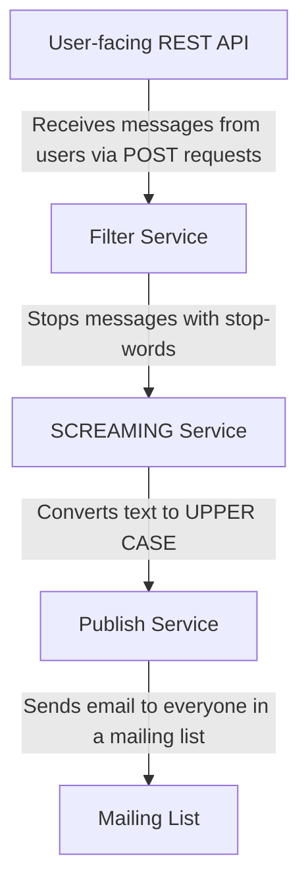

# Task: Message Brokers

You are to build a event-driven system. It should follow a broker topology and use RabbitMQ
to pass messages. Since you had an assignment about pipes-and-filters, you should quickly
understand how it works. Instead of filters you will have services and instead of pipes/queues
between processes/threads you will have message broker queues.

Since message brokers are usually not built to pass large files like images (though they are
capable), we will work with text.

You can use any non-functional and non-esoteric programming language of your choosing
for the implementation. After finishing the system, rebuild it as pipes-and-filters. You can
reuse the same code, just replace brokers with pipes/queues and put services into a single
deployable app as filters. Measure performance differences. If using Python, make sure to run
every filter in a separate process, not thread (because of GIL). In general, do not use green
threads and parallelisation methods that are not suited for CPU-bound tasks.

Compare performance between pipes-and-filters and event-driven variations by load-testing
it and write a small report on performance differences. In the report please explain
differences in time behaviour, resource utilisation and capacity or the lack of them.

# System description

The system is split into 4 services:

1. User-facing REST API server that receives POST request from the users consisting of
    message text and user alias.
2. Filter service filters messages for a stop-words. The stop-words are: bird-watching,
    ailurophobia and mango. If there are stop words in the message, then it should not be
    sent to the next services.
3. SCREAMING Service converts messages to upper case.
4. Publish service should send email to the emails of your team members. It’s a good idea to
    use one email or throw-away email during tests to not spam your team. Email body
    example:

From user: professor
Message: SERVICES SHOULD BE SEPARATELY DEPLOYABLE UNITS!

# Submission artifacts

- Git repository URL
- Video demo uploaded to YouTube or Google Drive

# Grading criteria

- Proper usage of RabbitMQ as a message broker.
    **- 4/10 points**
- Compliance of implementation with system description. Services should be separately
    deployable units!
    **- 3/10 points**
- Quality of performance testing and testing report.
    **- 2/10 points**
- Quality of codebase organisation: naming of files and folders, clear separation of
    concerns, helpful README.md. Services should be clearly separated into folders.
    **- 1/10 point**
